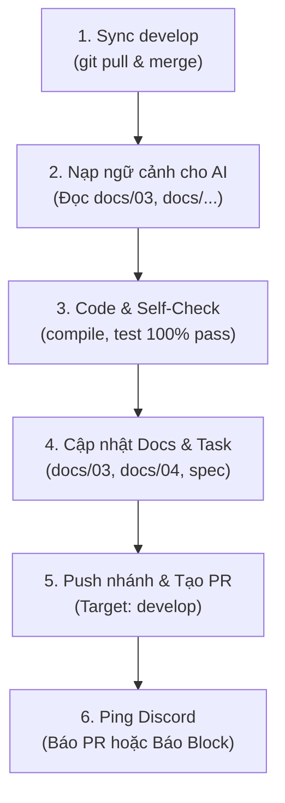

# 🚀 CẨM NANG WORKFLOW & QUY TẮC LÀM VIỆC CHUẨN TEAM OMNIDRAW (NCKH)
> *"Code sạch — Sync chuẩn — Test xanh — Docs đủ — Ping nhanh"*

Chào cả team! Để dự án chạy mượt mà, tài liệu và tiến độ luôn ăn khớp theo thời gian thực và giúp bạn Lead review/merge nhanh nhất, tất cả thành viên khi bắt đầu phiên làm việc hoặc nhận task mới vui lòng tuân thủ nghiêm ngặt **Quy trình 6 bước** dưới đây.

---

## 📋 TỔNG QUAN QUY TRÌNH 6 BƯỚC



---

## 🔄 BƯỚC 1: ĐỒNG BỘ CODE MỚI NHẤT TỪ DEVELOP (ALWAYS SYNC FIRST)

Trước khi gõ bất kỳ dòng code nào hay mở phiên làm việc mới, việc đầu tiên là phải lấy code mới nhất về máy:

```bash
# 1. Chuyển sang nhánh develop và kéo code mới nhất về
git checkout develop
git pull origin develop

# 2. Quay lại nhánh làm việc của bạn và gộp code mới từ develop vào
git checkout feature/<tên-nhánh-của-bạn>
git merge develop
```

> [!IMPORTANT]
> **Quy tắc:** Tuyệt đối không code trên một nhánh đã lỗi thời so với `develop` để tránh xung đột đè nát code của nhau.

---

## 🧠 BƯỚC 2: NẠP NGỮ CẢNH CHO AI TRƯỚC KHI CODE (CONTEXT IS KING)

Nếu bạn dùng AI Agent (Antigravity, Cursor, Claude, ChatGPT...), đừng vội yêu cầu AI viết code ngay. Hãy để AI đọc hiểu kiến trúc trước:

1. **Yêu cầu AI đọc các tài liệu liên quan:**
   - Đọc task hiện tại: `docs/03_current-task.md`
   - Đọc quy chuẩn kỹ thuật của mảng mình làm: `docs/01_tech-stack.md`, tài liệu trong `docs/hardware/` hoặc `docs/05_ca_vhc_research_spec.md`...
2. **Khoanh vùng phạm vi:** 
   - Nhắc AI rõ ràng: *"Chỉ sửa các file thuộc tính năng X, tuyệt đối không sửa code/test của các track khác nếu không được giao."*

---

## 🛠️ BƯỚC 3: CODE VÀ TỰ KIỂM CHỨNG (SELF-CHECK 100% PASS)

Code xong chưa phải là xong! Bạn phải tự tay chạy kiểm chứng xem máy mình có chạy được không:

1. **Kiểm tra sạch conflict markers (Không để sót rác Git):**
   ```bash
   git grep -E "^(<<<<<<<|=======|>>>>>>>)"
   ```
   *(Lệnh này không được hiện ra bất kỳ dòng nào)*

2. **Kiểm tra cú pháp Python (Tránh đẩy code bị SyntaxError):**
   ```bash
   python3 -m py_compile <đường-dẫn-file-vừa-sửa.py>
   # Ví dụ: python3 -m py_compile backend/main.py
   ```

3. **Chạy bộ Unit Test liên quan (Phải xanh lá 100%):**
   ```bash
   pytest tests/<file_test_của_bạn>.py
   # Ví dụ: pytest tests/test_hardware_adapter.py
   ```

> [!TIP]
> **Quy tắc:** Chỉ khi tất cả các test đều **PASS** và không còn lỗi cú pháp thì mới chuyển sang Bước 4.

---

## 📝 BƯỚC 4: NHỜ AI CẬP NHẬT DOCS & TASK TIẾN ĐỘ (BẮT BUỘC SAU MỖI PHIÊN)

Code đã chạy ngon, trước khi commit, **hãy yêu cầu AI cập nhật lại tài liệu và nhật ký tiến độ** của phiên làm việc đó:

1. **Cập nhật danh sách Task (`docs/03_current-task.md`):**
   - Đánh dấu tick `[x]` cho các đầu việc vừa hoàn thành.
   - Ghi chú các việc tiếp theo cần làm ở phiên sau (nếu có).
2. **Ghi nhật ký tiến độ (`docs/04_progress-log.md`):**
   - Thêm mục mới ghi rõ ngày tháng, tóm tắt tính năng vừa xong, số lượng test pass và bằng chứng kiểm thử.
3. **Cập nhật tài liệu kỹ thuật chuyên môn:**
   - Nếu có tạo API mới, sửa cấu hình YAML hay thêm thuật toán mới, nhờ AI bổ sung ngay vào file docs tương ứng (ví dụ: `docs/hardware/...`, `docs/01_tech-stack.md`...).

> [!IMPORTANT]
> **Quy tắc:** Không để "code đi trước, tài liệu ở lại phía sau". Sau mỗi phiên, tài liệu phải phản ánh đúng 100% hiện trạng code.

---

## 📤 BƯỚC 5: PUSH LÊN NHÁNH RIÊNG & TẠO PULL REQUEST (PR)

Khi cả Code, Test và Docs đều đã đồng bộ:

1. **Commit và Push lên nhánh của bạn trên GitHub:**
   ```bash
   git add <các_file_code_test_va_docs_da_sua>
   git commit -m "feat(<mảng>): mô tả ngắn gọn việc bạn đã làm + update docs"
   git push origin feature/<tên-nhánh-của-bạn>
   ```

2. **Lên GitHub tạo Pull Request (PR):**
   - Base branch (nhánh đích): `develop`
   - Compare branch (nhánh của bạn): `feature/<tên-nhánh-của-bạn>`
   - Ghi mô tả ngắn: Các file đã sửa, tình trạng test, tài liệu đã cập nhật.
   
> [!WARNING]
> **LƯU Ý QUAN TRỌNG:** **KHÔNG ĐƯỢC TỰ BẤM MERGE!** Hãy để Lead kiểm tra thay đổi (diff) và Lead sẽ là người bấm merge vào `develop`.

---

## 📢 BƯỚC 6: THÔNG BÁO NGAY LÊN DISCORD (KEEP TEAM IN THE LOOP)

Mỗi khi bạn hoàn thành hoặc gặp khó khăn, hãy bắn tin lên kênh Discord của nhóm theo mẫu sau:

* **Trường hợp 1: Khi hoàn thành task & tạo PR xong:**
  > 🎯 `@Lead` Mình vừa tạo PR cho task **[Tên task]**!  
  > 🔗 **Link PR:** `https://github.com/.../pull/...`  
  > 🧪 **Tình trạng:** Đã self-check, pass toàn bộ unit tests, đã nhờ AI cập nhật `docs/03` và `docs/04`. Nhờ Lead review và merge giúp mình nhé!

* **Trường hợp 2: Khi gặp bug hóc búa, bị block hoặc có thắc mắc kỹ thuật:**
  > 🛑 `@Team` Mình đang làm task **[Tên task]** thì bị vướng ở đoạn **[mô tả lỗi ngắn gọn]**.  
  > 📌 **Chi tiết/File:** `backend/...`  
  > 💡 Cần mọi người hỗ trợ cùng gỡ đoạn này giúp mình với!

---

## ⛔ 4 ĐIỀU TUYỆT ĐỐI "CẤM KỴ" (RED FLAGS)

| STT | Điều cấm kỵ | Lý do / Hậu quả |
| :---: | :--- | :--- |
| ❌ 1 | **Không push code chưa chạy thử** | Tuyệt đối không đẩy code lỗi cú pháp hoặc test đang fail lên repo chung làm hỏng môi trường của người khác. |
| ❌ 2 | **Không quên cập nhật docs** | Code xong mà không cập nhật `docs/03` và `docs/04` coi như chưa hoàn thành task; người tiếp theo sẽ mất phương hướng. |
| ❌ 3 | **Không tự ý sửa code của track khác** | Phần cứng không tự ý sửa thuật toán chữ viết; frontend không tự ý sửa engine backend (nếu cần đổi API, thảo luận trước). |
| ❌ 4 | **Không "ôm việc âm thầm" khi bị kẹt** | Nếu bị bug/block quá 2 tiếng mà không giải quyết được, **bắt buộc** phải hú lên Discord để cả team cùng hỗ trợ! |

---

🎯 *Chúc cả team phối hợp mượt mà, code bon bon và cùng nhau đưa dự án về đích rực rỡ nhé!* 🚀
